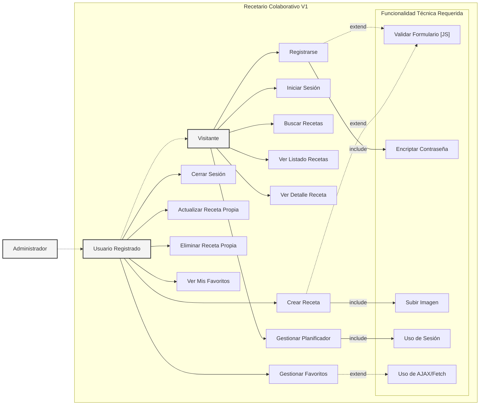
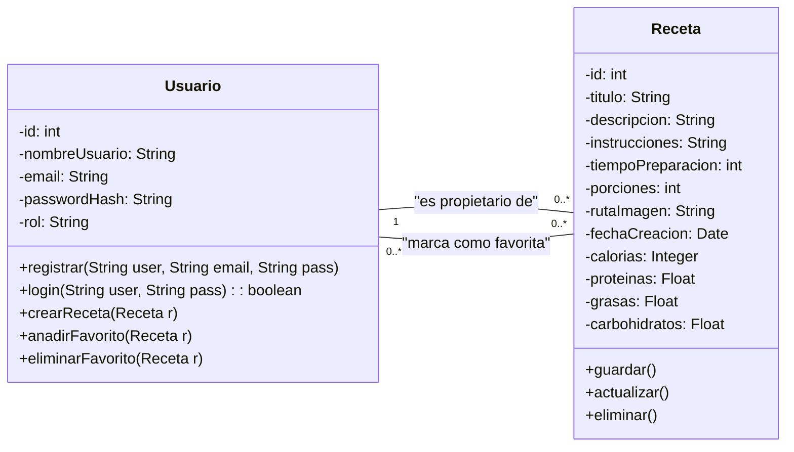

# Desarrollo práctica DAW
## Preguntas al profesor
- [ ] El controlador debería hacer uso de *DAOs* (Data Access Object) en [[#^1ecec6]] [backend](#v1-mvp-funcional-requisitos-asignatura)
- [ ] 
## Propuesta Aplicación Web DAW
### 🧑‍🍳Recetario Colaborativo
Plataforma Web donde los usuarios pueden registrarse para compartir sus propias recetas y descubrir las de otros usuarios.

- **Gestión de Usuarios y Roles**:

    - **Visitantes**: Pueden ver y buscar recetas.
        
    - **Usuarios Registrados**: Pueden subir, editar y eliminar sus propias recetas, (escribir comentarios en otras -> complejidad de implementarlo ?) y guardar sus recetas favoritas. 
    - **Usuarios administradores**: Varios usuarios tendrán el rol de administrador para asegurarse que los usuarios cumplen con las normas comunitarias y hay ambiente sano en la web. Podrán gestionar al resto de usuarios:
	    - Suspensión temporal de usuarios.
	    - Eliminar Usuarios.
	    - Eliminar contenido de otros usuarios.
		    - De forma temporal: posibilidad de revisión por parte del creador.
		    - De forma permanente.
		    - ==Buscar más ideas==
		
- **Entidad Principal (CRUD - "Receta")**:

    - La entidad principal es la **Receta**.
        
    - Un usuario registrado puede **crear** una nueva receta, subiendo una foto del plato terminado, rellenando ingredientes e instrucciones. También puede **leer** (ver) las suyas y las de otros, **actualizar** sus propias recetas y **borrarlas**.
	
> [!note] 
> **Posible idea *API***
> Permitir al usuario indicar marcas de los ingredientes que utiliza (si el usuario no quiere, usar productos genéricos en su defecto) y con ellos hacer uso de la API de [OpenFoodFacts](https://es.openfoodfacts.org) para calcular las calorías y macronutrientes de la receta.

- **Funcionalidad del "Carrito"**:
    
    - Se implementaría como una sección de **"Mis Recetas Favoritas"** o un **"Planificador de Menú Semanal"**. Los usuarios podrían añadir recetas a esta lista personal, que se gestionaría con sesiones.
	- Implementar un **Planificador de Menú Semanal** donde el usuario (en la sesión activa) pueda ir añadiendo recetas (tanto ajenas, propias o guardadas en favoritos) a un Menú para la semana, dando la opción a *descargar* el menú en varios formatos antes de cerrar sesión. 
		- Estaría bien avisar al usuario que si abandona la página y no guarda el planificador, se borrará??
		- Posibilidad de descargar en varios formatos: pdf, xml/json?, csv(o cualquiera de excel)
        
- **Uso de AJAX/Fetch**:
    
    - Se usaría para que un usuario pueda añadir una receta a su lista de "Favoritos" o al "Planificador" con un solo clic y sin recargar la página. También podría usarse para un sistema de valoración por estrellas dinámico.
## Roadmap por fases
### Análisis inicial
- [ ] DRS
	- [ ] Diagrama de casos de uso
- [ ] Diagrama de clases
- [ ] Diagrama entidad relación
### V1: MVP Funcional (Requisitos Asignatura)
- [ ] **Backend:** ^1ecec6
    - [ ] Implementar patrón MVC (Servlets/JSP).
    - [ ] Configurar acceso a datos (JPA).
- [ ] **Gestión de Usuarios:**
    - [ ] CRUD (Registro, Login).
    - [ ] Seguridad: Encriptación de contraseñas en BBDD.
    - [ ] Seguridad: Autenticación y Autorización.
- [ ] **Gestión de Recetas (Entidad Principal):**
    - [ ] CRUD completo de `Receta`.
    - [ ] Subida de imagen en la creación.
    - [ ] Autorización (solo propietario modifica/borra).
    - [ ] Campos de macros (entrada manual).
- [ ] **Funcionalidad "Carrito" (Planificador):**
    - [ ] Implementar Planificador Semanal.
    - [ ] Uso de Sesiones HTTP para persistencia temporal.
- [ ] **Frontend (Interacción):**
    - [ ] HTML/CSS/JS (base funcional).
    - [ ] Validación de formularios (JavaScript).
    - [ ] Peticiones asíncronas (AJAX/Fetch) para "Favoritos" (**preguntar al profesor. No entiendo bien esta parte**).
- [ ] **Sistema de Favoritos:**
    - [ ] CRUD de Favoritos (persistente en BBDD, asociado a usuario).

### V1.5: Capa de Presentación 🎨
- [ ] **Estilos:**
    - [ ] Integración de CSS personalizado.
    - [ ] Implementación de Bootstrap.
- [ ] **UX/UI:**
    - [ ] Refinamiento de la interfaz.
    - [ ] Diseño *responsive*.

### V2: Funcionalidad Extendida 🌟
- [ ] **Sistema de Comentarios:**
    - [ ] CRUD de la entidad `Comentario`.
    - [ ] Relaciones (N-1) con `Usuario` y `Receta`.
- [ ] **Sistema Social (Follow):** 
	- [ ] Implementar sistema de 'Seguimiento' (N-M entre `Usuario`-`Usuario`). 
	- [ ] Lógica de seguimiento unilateral (sin aprobación).
- [ ] **Integración de APIs Externas:**
    - [ ] Conexión a API (OpenFoodFacts).
    - [ ] Conexión a API (The Swiss Food Composition Database).
    - [ ] Cálculo automático de macros/calorías.
    - [ ] Conexión a API de stock de fotos (ej. Pexels, Unsplash). 
		- [ ] Añadir buscador de imágenes en el formulario de recetas.
- [ ] **Gestión de Administradores:**
    - [ ] Panel de moderación (suspender usuarios, borrar contenido).
- [ ] **Control de Visibilidad de Recetas:**
    - [ ] Añadir atributo "publica" (booleano) a la entidad `Receta`.
    - [ ] Permitir al usuario marcar sus recetas como públicas o privadas.
    - [ ] Lógica de autorización: Recetas privadas solo visibles por el propietario.
- [ ] **Funcionalidad "Carrito" (Planificador):**
	- [ ] Ampliar funcionalidad permitiendo al usuario descargar la planificación antes de cerrar sesión. Admitir distintos formatos (pdf, csv, xml)

## Fases del proyecto detalladas
### V1: Producto Mínimo Viable (MVP)

_Cumplir con requisitos de la guía_

- **Backend:**
    
    - Implementación del patrón **MVC** con Servlets/JSP.
    - Configuración de la conexión a la base de datos (JPA).
        
- **Gestión de Usuarios:**
    
    - CRUD de `Usuario`: Registro, Login y (opcionalmente) Perfil Básico.
        
    - Seguridad: **Encriptación de contraseñas** en la BBDD (**mirar métodos de cifrado disponibles en java**).
        
    - Autenticación (Login) y Autorización (control de acceso a rutas).
        
- **Gestión de Recetas:**
    
    - CRUD completo de la entidad `Receta`.
        
    - Formulario de creación/edición que incluya la **subida de imagen**.
        
    - Autorización: Asegurar que solo el propietario puede editar o borrar su receta.
        
    - Campos de macros (`calorias`, `proteinas`, etc.) para **entrada manual** del usuario.
        
- **Funcionalidad "Carrito":**
    
    - Implementación del **Planificador Semanal** no persistente.
        
    - Debe usar **Sesiones HTTP** para almacenar temporalmente las recetas añadidas.
        
- **Frontend (Funcional):**
    
    - HTML semántico (sin estilo de momento).
        
    - **Validación de formularios** (Registro, Login, Nueva Receta) mediante JavaScript.
        
    - Uso de **AJAX/Fetch** para añadir recetas a "Favoritos" sin recarga.
        
- **Sistema de Favoritos:**
    
    - Funcionalidad para que un usuario registrado guarde/quite recetas de su lista personal (persistente en BBDD).
        

---

### V1.5: Mejorar estilos

_Aplicar estilos al frontend_

- Integración de **CSS** personalizado para dar estilo a la plataforma.
    
- Implementación de **Bootstrap**  para un diseño _responsive_ y amigable.
    
- Refinamiento de la interfaz de usuario (UI/UX).
    

---

### V2: Mejoras y Funcionalidad Extendida

_Añadir funcionalidades extra  a la web _

- **Sistema de Comentarios:**
    
    - Implementación del CRUD para la entidad `Comentario`.
        
    - Creación de la relación `Comentario` N-1 `Usuario` y `Comentario` N-1 `Receta`.
        
    - Visualización de comentarios en la página de detalle de la receta.
		
- **Sistema de Seguimiento (Follow):** 
	- Se implementará una relación N-M (Usuario-Usuario) que permita a un usuario "seguir" a otro de forma unilateral (sin solicitud de aprobación).
- **Integración de APIs Externas:**
    
    - Conexión con **OpenFoodFacts** (para productos procesados/con código de barras).
	    
	- Conexión con **The Swiss Food Composition Database** (para alimentos base/no procesados).
		
    - Cálculo automático de macros/calorías basado en la selección de las APIs.
        
    - Modificación del formulario de `Receta` para buscar ingredientes en la API.
        
    - Cálculo automático de macros/calorías basado en la selección de la API (sobrescribiendo la entrada manual).
		
	- **Integración de API de Imágenes (Stock):** - El sistema permitirá al `Usuario Registrado`, además de subir su propia foto, buscar e importar una imagen desde un servicio de fotos de stock (ej. Pexels) mediante su API. - La entidad `Receta` deberá poder almacenar tanto un path local (V1) como una URL externa (V2) en su atributo `rutaImagen`.
- **Gestión de Administradores (Avanzada):**
    
    - Implementación de los casos de uso para `Administrador` (suspender usuarios, eliminar contenido ajeno).
	
- **Control de Visibilidad de Recetas:**
    - El `Usuario Registrado` podrá definir sus recetas como "Públicas" (visibles por todos) o "Privadas" (visibles por seguidores).
    - El sistema implementará la lógica de negocio para restringir el acceso a las recetas privadas.

## Documento de Requisitos (DRS) - V1
### Proyecto: Recetario Colaborativo

#### 1. Descripción General

El proyecto consiste en una aplicación web desarrollada en Java (stack MVC) que permite a los usuarios compartir y descubrir recetas de cocina. La V1 se centrará en las funcionalidades básicas de gestión de usuarios, gestión de recetas (CRUD), un sistema de favoritos persistente y un planificador de menú semanal basado en sesión sin centrarnos en los estilos del frontend.

#### 2. Actores del Sistema

1.  **Visitante (No autenticado):** Usuario anónimo que puede navegar por el sitio, ver el listado de recetas públicas y buscar recetas.
2.  **Usuario Registrado (Autenticado):** Usuario que ha iniciado sesión. Tiene todos los permisos del Visitante y, además, puede crear, editar y eliminar sus propias recetas, y gestionar su lista de favoritos.
3.  **Administrador:** (Definido para V1, pero con funcionalidad limitada). Un tipo de `Usuario Registrado` con permisos para futuras tareas de moderación. En V1, su funcionalidad es idéntica a la del Usuario Registrado.

#### 3. Requisitos Funcionales (RF)

##### RF.1: Gestión de Usuarios (Autenticación)
- **RF.1.1:** El sistema debe permitir a un `Visitante` registrarse como nuevo `Usuario Registrado`. Los campos mínimos serán: nombre de usuario, email y contraseña.
- **RF.1.2:** El sistema debe encriptar la contraseña del usuario antes de almacenarla en la base de datos.
- **RF.1.3:** El sistema debe permitir a un usuario (Visitante o Registrado) iniciar sesión (autenticación).
- **RF.1.4:** El sistema debe permitir a un `Usuario Registrado` cerrar sesión.
- **RF.1.5:** El sistema debe restringir el acceso a funcionalidades de creación o edición solo a usuarios autenticados.

##### RF.2: Gestión de Recetas (CRUD Principal)
- **RF.2.1:** Un `Usuario Registrado` debe poder crear una nueva `Receta`.
- **RF.2.2:** El formulario de creación debe incluir, como mínimo: título, descripción, instrucciones (texto), tiempo, porciones y una **imagen** (subida de fichero).
- **RF.2.3:** El formulario de creación debe incluir campos opcionales (nulables) para `calorías`, `proteínas`, `grasas` y `carbohidratos` (entrada manual en V1).
- **RF.2.4:** Todos los usuarios (Visitantes y Registrados) deben poder ver el listado de recetas publicadas.
- **RF.2.5:** Todos los usuarios deben poder ver la página de detalle de una receta específica.
- **RF.2.6:** Un `Usuario Registrado` solo debe poder **actualizar** las recetas de las que es propietario.
- **RF.2.7:** Un `Usuario Registrado` solo debe poder **eliminar** las recetas de las que es propietario.

##### RF.3: Sistema de Favoritos (Persistente)
- **RF.3.1:** Un `Usuario Registrado` debe poder añadir cualquier receta a su lista personal de "Favoritos".
- **RF.3.2:** Un `Usuario Registrado` debe poder eliminar una receta de su lista de "Favoritos".
- **RF.3.3:** La acción de añadir/quitar de favoritos debe realizarse de forma asíncrona (usando **AJAX/Fetch**) sin recargar la página.
- **RF.3.4:** Un `Usuario Registrado` debe poder consultar una página donde se listen todas sus recetas favoritas.

##### RF.4: Planificador Semanal (Sesión - "Carrito")
- **RF.4.1:** Cualquier usuario (Visitante o Registrado) debe poder añadir una receta a un "Planificador Semanal".
- **RF.4.2:** Esta funcionalidad debe implementarse usando **Sesiones HTTP**.
- **RF.4.3:** El contenido del planificador es temporal y se pierde al expirar la sesión.
- **RF.4.4:** El usuario debe poder ver las recetas añadidas a su planificador actual.
- **RF.4.5:** (Opcional V1) El usuario podrá exportar este planificador (PDF, JSON).

##### RF.5: Interfaz y Validación
- **RF.5.1:** El sistema debe usar **JavaScript** para realizar validaciones en el lado del cliente en los formularios (ej. registro, login, nueva receta).
- **RF.5.2:** Todos los usuarios deben poder realizar búsquedas simples de recetas (ej. por título).

#### 4. Requisitos No Funcionales (RNF)

- **RNF.1 (Arquitectura):** La aplicación debe seguir el patrón **MVC**.
- **RNF.2 (Tecnología Backend):** Se utilizará Java (Servlets/JSP o framework) y **JPA** para el acceso a datos.
- **RNF.3 (Seguridad):** La aplicación debe servirse bajo **HTTPS** (protocolo seguro).
- **RNF.4 (Seguridad):** Las contraseñas deben almacenarse usando un algoritmo de *hashing* seguro (ej. BCrypt).
- **RNF.5 (Estilo):** La V1 se centrará en la funcionalidad. La V1.5 se dedicará a la implementación de CSS y Bootstrap.

#### 5. Mejoras Planificadas (Post-V1)

- **V2:** Implementación de un sistema de `Comentarios` (Entidad `Comentario` con relaciones N-1 a `Usuario` y `Receta`).
- **V2:** Integración con APIs (OpenFoodFacts y The Swiss Food Composition Database) para el cálculo automático de macros.
- **V2:** Integración con APIs de webs de stock de imágenes
- **V2:** Funcionalidad avanzada de `Administrador` (moderación).

### Diagrama de casos de Uso

### Diseño del sistema
#### Diagrama de Clases

